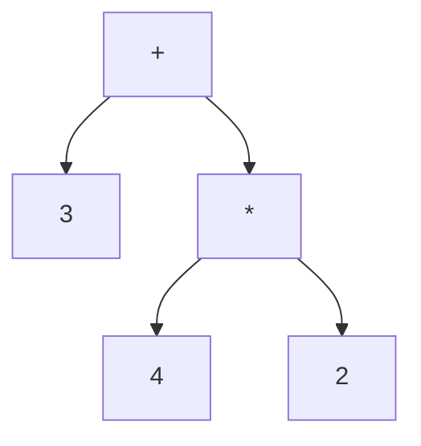
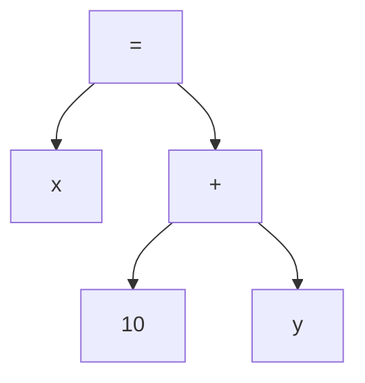
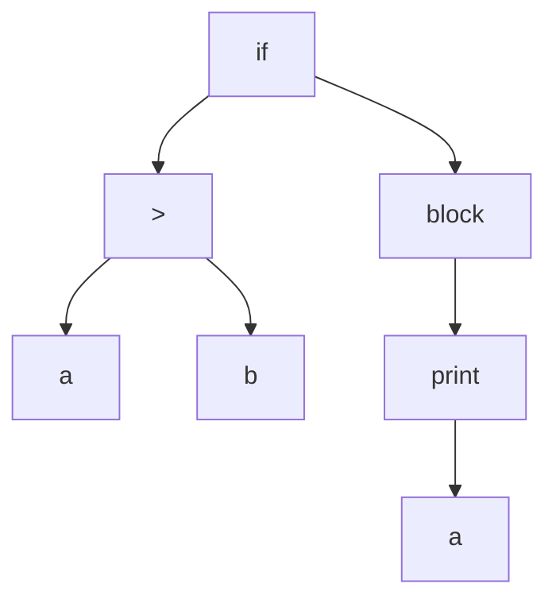
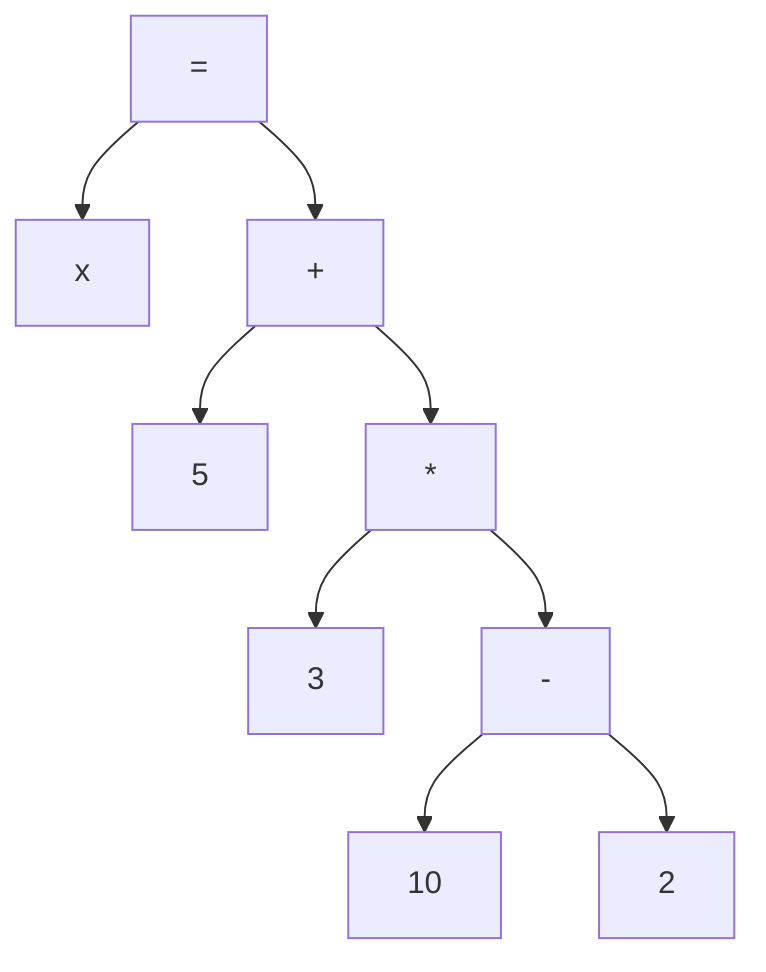

# Projet : Création d'un Interpréteur de Langage de Programmation

## Objectif Général

Par groupes de 3, vous allez créer un ***interpréteur*** simple pour un langage de programmation de votre invention. Ce projet vous permettra d'approfondir vos connaissances en C et de comprendre les bases du fonctionnement des interpréteurs.

## Lexique

- ***Lexer (Analyseur lexical)*** : Composant qui transforme le code source en une série de tokens.
- ***Parser (Analyseur syntaxique)*** : Composant qui analyse la structure des tokens pour créer une représentation structurée du programme.
- ***AST (Arbre de Syntaxe Abstraite)*** : Structure de données représentant la structure syntaxique du code source.
- ***Token*** : Unité lexicale élémentaire, comme un mot-clé, un identificateur, ou un opérateur.
- ***Interpréteur*** : Programme qui exécute directement les instructions d'un langage de programmation sans les compiler préalablement.

## Fonctionnement du Programme

Votre ***interpréteur*** devra fonctionner de deux manières :

1. **Mode Fichier** : L'utilisateur pourra exécuter un fichier contenant le code source.

    ```bash
    ./mon_interpreteur fichier.monlang
    ```

2. **Mode Interactif** : L'utilisateur pourra entrer des commandes directement dans une interface en ligne de commande.

    ```python
    ./mon_interpreteur
    > x = 5
    > print(x)
    5
    ```

## Étapes du Projet

### Étape 1 : La Calculatrice de Base et Entrée Simple (Semaine 1-2)

**Objectif** : Créer un ***interpréteur*** capable d'évaluer des expressions arithmétiques simples et d'assigner des valeurs à des variables, avec une méthode d'entrée de base.

**Tâches** :

1. Implémentez un ***lexer*** pour ***tokenizer*** les entrées.
    - Identifiez les différents types de ***tokens*** : nombres, opérateurs, parenthèses, etc.
    - Transformez la chaîne d'entrée en une liste de ***tokens***.
2. Créez un ***parser*** pour analyser les expressions arithmétiques.
    - Utilisez un algorithme comme "Shunting Yard" pour gérer la priorité des opérations.
    - Construisez un ***AST*** simple.
3. Évaluez les expressions : addition, soustraction, multiplication, division.
    - Parcourez l'***AST*** de manière récursive pour évaluer l'expression.
4. Implémentez l'assignation de variables.
    - Créez une structure de données (comme une table de hachage) pour stocker les variables et leurs valeurs.
    - À ce stade, toutes les variables seront considérées comme globales.
5. Ajoutez une fonction `print()` pour afficher les résultats.
    - Implémentez une fonction intégrée qui prend un argument et l'affiche.
6. Créez une fonction simple pour tester votre ***interpréteur***.
    - Implémentez une fonction qui prend une chaîne de caractères comme entrée et l'interprète.
    - Cette fonction sera utilisée pour tester votre ***interpréteur*** en attendant l'implémentation complète de l'étape 2.

**Exemples** :

```c
// Fonction de test à implémenter dans votre code
void interpret(const char* input) {
    // Votre code pour interpréter la chaîne input
}

// Dans votre fonction main()
interpret("x = 10");
interpret("y = x + 5");
interpret("print(y)");  // Doit afficher 15
interpret("a = 3 + 4 * 2");  // Doit donner a = 11
interpret("b = (1 + 2) * (3 - 1)");  // Doit donner b = 6
interpret("print(a)");  // Doit afficher 11
interpret("print(b)");  // Doit afficher 6

```

### Étape 2 : Gestion des Entrées (Semaine 2-3)

**Objectif** : Permettre différents formats d'entrée pour les instructions.

**Tâches** :

1. Implémentez la lecture d'instructions à partir d'un fichier.
    - Utilisez les fonctions de lecture de fichiers en C (`fopen`, `fread`, etc.).
    - Lisez le fichier ligne par ligne ou en totalité selon votre approche.
2. Créez un mode interactif où l'utilisateur peut entrer des instructions dans la console.
    - Utilisez une boucle de lecture (Read-Eval-Print Loop ou REPL).
    - Implémentez des commandes spéciales comme 'exit' pour quitter le mode interactif.
3. Adaptez la fonction d'interprétation créée à l'étape 1 pour qu'elle fonctionne avec ces nouveaux modes d'entrée.
    - Assurez-vous que votre système de gestion des entrées soit flexible pour accommoder les futures implémentations de portée de variables.
4. (Bonus) Si vous utilisez un ***AST***, ajoutez une fonction pour l'afficher.
    - Implémentez un parcours en profondeur de l'***AST*** pour l'afficher de manière lisible.

---

### Étape 3 : Structures de Contrôle et Chaînes de Caractères (Semaine 3-4)

**Objectif** : Ajouter des structures de contrôle, la gestion des chaînes de caractères, et implémenter une portée des variables correcte.

**Tâches** :

1. Implémentez les boucles `while` et `for`.
    - Modifiez votre ***parser*** pour reconnaître ces nouvelles structures.
    - Ajoutez des nœuds correspondants dans votre ***AST***.
    - Implémentez l'évaluation de ces structures dans votre interpréteur.
2. Ajoutez les conditions `if` et `else`.
    - Comme pour les boucles, adaptez le parser, l'***AST*** et l'évaluateur.
3. Intégrez la manipulation de chaînes de caractères.
    - Ajoutez un nouveau type de ***token*** pour les chaînes.
    - Implémentez des opérations de base comme la concaténation.
4. Gérez la portée des variables dans les différentes structures.
    - Implémentez un système de portée (peut-être avec une pile de tables de symboles).
5. Gérez la portée des variables correctement.
    - Implémentez un système de portée en blocs.
    - Les variables déclarées dans un bloc (comme un `if`, `while`, ou `for`) ne doivent être accessibles que dans ce bloc et ses sous-blocs.
    - Les variables déclarées en dehors de tout bloc sont considérées comme globales.

**Exemples** :

```python
i = 0
while (i < 5) {
  i = i + 1
}
print(i)  // Doit afficher 5

x = 10
if (x > 5) {
  result = "Grand"
} else {
  result = "Petit"
}
print(result)  // Erreur : result n'est pas défini dans ce scope

greeting = "Bonjour"
fullGreeting = greeting + ", tout le monde!"
print(fullGreeting)  // Doit afficher "Bonjour, tout le monde!"
```

### Étape 4 : Fonctions (Semaine 4-5)

**Objectif** : Permettre la définition et l'appel de fonctions.

**Tâches** :

1. Implémentez la déclaration de fonctions avec paramètres.
    - Ajoutez la reconnaissance de la syntaxe des fonctions dans votre ***parser***.
    - Créez une structure pour stocker les informations sur les fonctions (nom, paramètres, corps).
2. Gérez les appels de fonction et le retour de valeurs.
    - Implémentez un mécanisme pour appeler des fonctions et gérer leur pile d'appels.
    - Ajoutez la gestion des valeurs de retour.
3. Assurez-vous de la bonne gestion de la portée des variables dans les fonctions.
    - Les paramètres de fonction et les variables déclarées à l'intérieur d'une fonction doivent avoir une portée locale à cette fonction.
    - Les variables globales doivent rester accessibles à l'intérieur des fonctions, sauf si une variable locale du même nom les masque.
    - Implémentez un mécanisme pour différencier les variables locales et globales lors de l'exécution des fonctions.

**Exemples** :

```python
fonction ajouter(a, b) {
  return a + b
}
result = ajouter(3, 5)
print(result)  // Doit afficher 8

fonction afficherMessage() {
  print("Ceci est un message.")
}
afficherMessage()  // Doit afficher "Ceci est un message."

fonction maximum(a, b) {
  if (a > b) {
    return a
  } else {
    return b
  }
}
max = maximum(10, 20)
print(max)  // Doit afficher 20
```

## Bonus (pour les groupes avancés)

- Implémentez un système de typage fort.
- Ajoutez la gestion des classes et objets.
- Créez des structures de données complexes (listes, dictionnaires, etc.).

## Ressources Recommandées

- [Crafting Interpreters](https://craftinginterpreters.com/) - Un guide complet sur la création d'interpréteurs.
- [Writing An Interpreter In Go](https://interpreterbook.com/) - Bien que ce soit en Go, les concepts sont applicables en C.
- [Build Your Own Lisp](http://www.buildyourownlisp.com/) - Un tutoriel pour créer un langage Lisp en C.
- [Let's Build A Simple Interpreter](https://ruslanspivak.com/lsbasi-part1/) - Une série d'articles sur la création d'un interpréteur simple.

### Lexer

Un ***lexer*** transforme une chaîne de caractères en une série de ***tokens***. Voici quelques exemples :

### Exemple 1 : Expression arithmétique simple**

**Input :**

```python
3 + 4 * 2
```

**Output du Lexer :**

```json
[
    {type: "NUMBER", value: "3"},
    {type: "OPERATOR", value: "+"},
    {type: "NUMBER", value: "4"},
    {type: "OPERATOR", value: "*"},
    {type: "NUMBER", value: "2"}
]
```

### Exemple 2 : Affectation de variable**

**Input :**

```python
x = 10 + y
```

**Output du Lexer :**

```json
[
    {type: "IDENTIFIER", value: "x"},
    {type: "ASSIGN", value: "="},
    {type: "NUMBER", value: "10"},
    {type: "OPERATOR", value: "+"},
    {type: "IDENTIFIER", value: "y"}
]
```

### Exemple 3 : Condition simple**

**Input :**

```python
if (a > b) { print(a); }
```

**Output du Lexer :**

```json
[
    {type: "KEYWORD", value: "if"},
    {type: "LPAREN", value: "("},
    {type: "IDENTIFIER", value: "a"},
    {type: "OPERATOR", value: ">"},
    {type: "IDENTIFIER", value: "b"},
    {type: "RPAREN", value: ")"},
    {type: "LBRACE", value: "{"},
    {type: "IDENTIFIER", value: "print"},
    {type: "LPAREN", value: "("},
    {type: "IDENTIFIER", value: "a"},
    {type: "RPAREN", value: ")"},
    {type: "SEMICOLON", value: ";"},
    {type: "RBRACE", value: "}"}
]
```

### AST

Un ***AST*** représente la structure hiérarchique de l'expression. Voici quelques exemples :

### Exemple 1 : Expression arithmétique simple

Pour l'expression `3 + 4 * 2`, l'***AST*** pourrait ressembler à :



### Exemple 2 : Affectation de variable

Pour l'expression `x = 10 + y`, l'***AST*** pourrait être :



### Exemple 3 : Condition simple

Pour `if (a > b) { print(a); }`, l'***AST*** pourrait être :



### Exemple combiné : Expression complexe

Pour l'expression `x = 5 + 3 * (10 - 2)`, l'***AST*** serait :



## Contraintes Techniques

- Tout le code doit être écrit en C.
- Seules les bibliothèques standard du C sont autorisées.

## Évaluation

- Fonctionnalité de l'interpréteur
- Qualité et lisibilité du code
- Présentation et démonstration (15 minutes par groupe)
- Créativité et fonctionnalités supplémentaires

## Remarques Importantes

- Chaque membre du groupe doit comprendre et être capable d'expliquer chaque ligne de code du projet.
- Des exemples de code sous forme de fichiers doivent être fournis pour démontrer les fonctionnalités de votre interpréteur.
- La copie de code non compris sera sévèrement pénalisée.

> **Bon courage à tous !**
